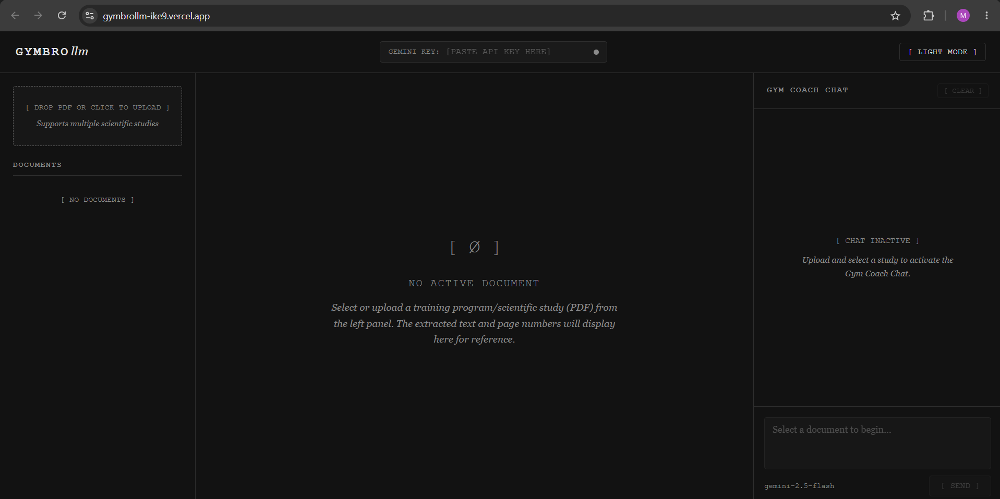

# GymBroLLM

An AI-powered notebooklm style research assistant that combines **Google Gemini 2.5 Flash** with the ability to upload pdf files to generate evidence-based gym recommendations or to learn more about health topics with the help of AI.

Upload a research paper, read it inside the application, and chat with an AI coach that answers strictly using the uploaded study while providing page citations.

---

# Screenshots

## Home Interface



---

## Uploading & Managing Research Papers


---

## Reading Scientific PDFs


---

## AI Gym Coach with Page Citations


---

# ✨ Features

- 📄 Upload scientific PDF research papers
- 📖 Built-in PDF viewer with page navigation
- 🤖 AI-powered Gym Coach using Google Gemini 2.5 Flash
- 📌 Automatic page citations (e.g. **[Page 4]**)
- 💬 Interactive chat interface
- 🌙 Light / Dark mode
- 📝 Markdown rendering
- 🔒 Secure API key handling (stored only in temporary browser memory)
- ⚡ Fully client-side application
- 🚀 Deployable directly to Vercel

---

# 🖥️ Application Layout

The application consists of three primary panels.

### 📂 Document Manager

- Upload PDF research papers
- View uploaded documents
- Delete documents
- Select the active paper

### 📖 Document Viewer

- View the uploaded PDF
- Navigate page by page
- Preserve page numbering for AI citations

### 🤖 Gym Coach Chat

- Ask questions about the uploaded research
- Generate evidence-based workout recommendations
- Receive responses with page citations
- Markdown formatted answers

---

# 🛠️ Technologies Used

- HTML5
- CSS3
- Vanilla JavaScript (ES Modules)
- PDF.js
- Google Gemini API (Gemini 2.5 Flash)

---

# 🔑 Gemini API Key

GymBroLLM requires your own Google Gemini API key.

The API key is:

- Entered directly into the application
- Stored only in temporary browser memory
- Never saved to Local Storage
- Never stored on a server

Generate your API key here:

https://aistudio.google.com/app/apikey

---

# 🚀 Running the Project

Clone the repository:

```bash
git clone https://github.com/YOUR_USERNAME/GymBroLLM.git
```

Open the project folder.

Since the application is completely client-side, you can simply open:

```
index.html
```

in your browser.

Alternatively, run a lightweight local server:

```bash
python -m http.server
```

or

```bash
npx serve
```

---

# 🌐 Deployment

This project is designed for static hosting.

It works perfectly with:

- Vercel
- GitHub Pages
- Netlify

No backend is required.

---

# 📁 Project Structure

```
GymBroLLM/
│
├── index.html
├── README.md
│
└── screenshots/
    ├── Screenshot 1.png
    ├── Screenshot 2.png
    ├── Screenshot 3.png
    └── Screenshot 4.png
```

---

# 🎯 Purpose

GymBroLLM demonstrates how Large Language Models can be combined with scientific literature to provide transparent, evidence-based fitness recommendations.

Unlike traditional AI chatbots, responses are grounded in the uploaded research paper and reference specific pages, allowing users to verify every recommendation.

---

# ⚠️ Disclaimer

GymBroLLM is intended for educational and research purposes only.

It does not replace professional medical advice, diagnosis, or treatment.

Always consult a qualified healthcare professional before beginning any exercise or training program.

---

# 👤 Author

**Mohammad**

Built as an AI-powered document assistant prototype using Google Gemini, PDF.js, and vanilla JavaScript.