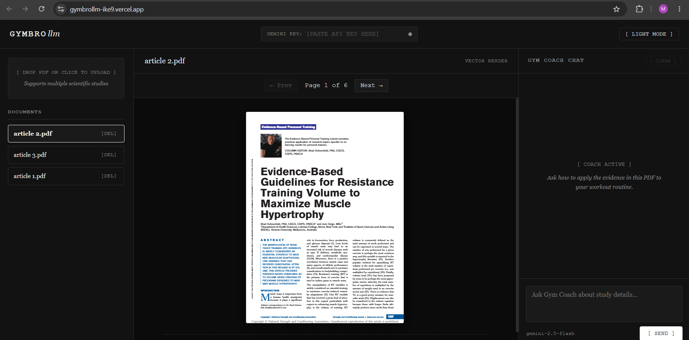
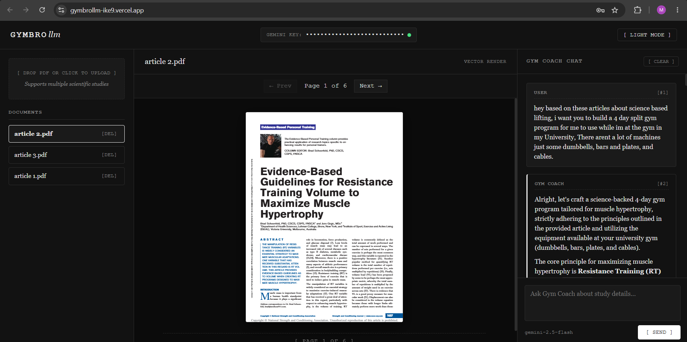
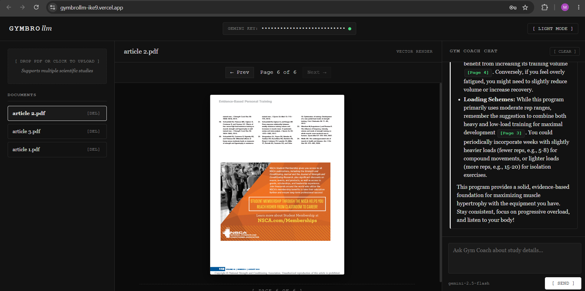
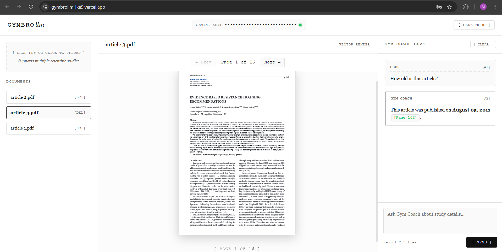
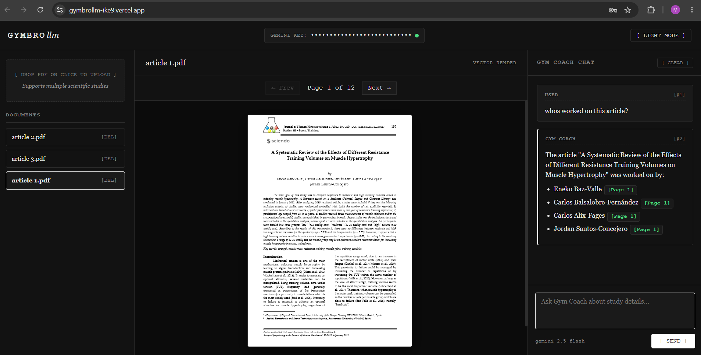

# GymBroLLM
An AI-powered notebooklm style research assistant that combines Google Gemini 2.5 Flash with the ability to upload pdf files to generate evidence-based gym recommendations or to learn more about health topics with the help of AI. Upload a research paper, read it inside the application, and chat with an AI coach that answers strictly using the uploaded study while providing page citations.

---

# Screenshots

## Home Interface


## Uploading & Managing Research Papers



## Reading Scientific PDFs



## AI Gym Coach with Page Citations



## Age of Article and White Mode



## Question About Authors



# ✨ Features
- Upload scientific PDF research papers
- Built-in PDF viewer with page navigation
- AI-powered Gym Coach using Google Gemini 2.5 Flash
- Automatic page citations (example: [Page 4])
- Interactive chat interface
- Light / Dark mode
- Markdown rendering
- Secure API key handling (stored only in temporary browser memory)
- Fully client-side application
- Deployable directly to Vercel

---

# 🖥️ Application Layout
The application consists of three primary panels.

### Left side which is for document manager
- Upload PDF research papers
- View uploaded documents
- Delete documents
- Select the active paper

### Center side which is for document viewer
- View the uploaded PDF
- Navigate page by page
- Preserve page numbering for AI citations

### Right side which is for Gym coach chat
- Ask questions about the uploaded research
- Generate evidence-based workout recommendations
- Receive responses with page citations
- Markdown formatted answers

---

# Technologies Used
- HTML5
- CSS3
- Vanilla JavaScript (ES Modules)
- PDF.js
- Google Gemini API (Gemini 2.5 Flash)
- Antigravity

---

# Gemini API Key
GymBroLLM requires your own Google Gemini API key. The API key is:
- Entered directly into the application
- Stored only in temporary browser memory
- Never saved to Local Storage
- Never stored on a server
- The light indicator tells you some information about the API key
- Red indicator means wrong API key
- Orange indicator means wait
- Green indicator means the API key is valid

# Deployment
This project is designed for static hosting. It works perfectly with:
- Vercel
No backend is required.

---

# Project Structure
```
GymBroLLM/

  index.html
  README.md

  screenshots/
    Age of article and white mode.png
    Home page.png
    Program.png
    Program2.png
    Question about authors.png
    Upload.png
```

---

# 🎯 Purpose
GymBroLLM demonstrates how Large Language Models can be combined with scientific literature to provide transparent, evidence-based fitness recommendations. Unlike traditional AI chatbots, responses are grounded in the uploaded research paper and reference specific pages, allowing users to verify every recommendation.

---

# One final important message
GymBroLLM is intended for educational and research purposes only. It does not replace professional medical advice, diagnosis, or treatment. Always consult a qualified healthcare professional before beginning any exercise or training program. Only use GymBroLLM if you are educated about sports and health.